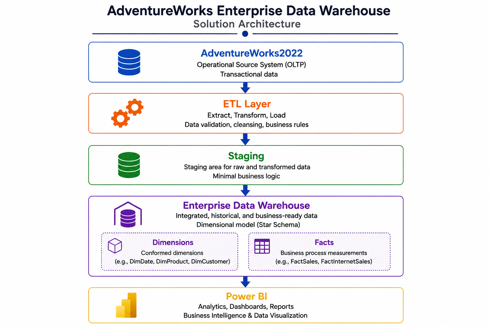
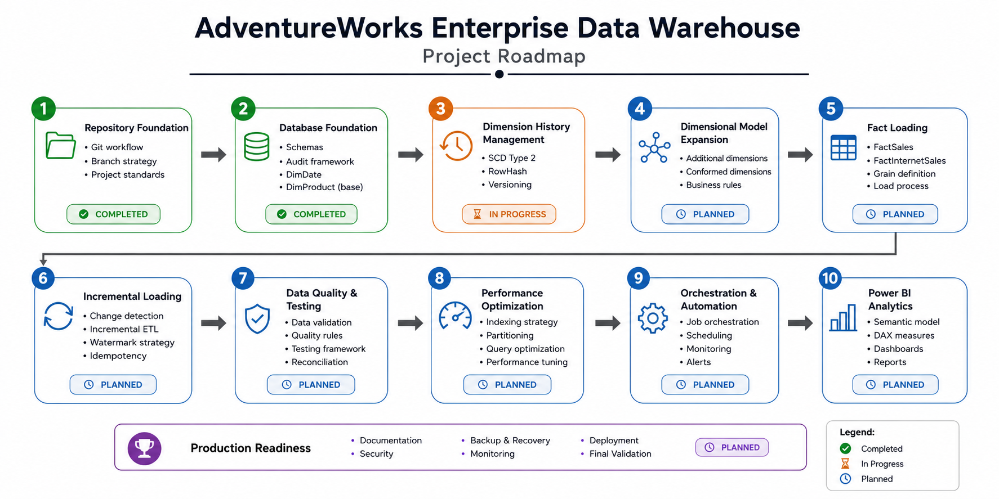

# AdventureWorks Enterprise Data Warehouse

<div align="center">

> Enterprise Data Warehouse built from scratch using SQL Server and T-SQL, following real-world Data Engineering best practices.

<br>


</div>

---

# Table of Contents

- [Overview](#overview)
- [Highlights](#highlights)
- [Business Problem](#business-problem)
- [Design Principles](#design-principles)
- [Solution Architecture](#solution-architecture)
- [Technology Stack](#technology-stack)
- [Repository Structure](#repository-structure)
- [Current Progress](#current-progress)
- [Current Features](#current-features)
- [Project Roadmap](#project-roadmap)
- [License](#license)

---

# Overview

AdventureWorks Enterprise Data Warehouse is an end-to-end Data Warehouse project built from scratch using SQL Server.

The project demonstrates the design and implementation of a production-oriented analytical platform by applying dimensional modeling, ETL development, auditing, Slowly Changing Dimensions (SCD Type 2), incremental loading, performance optimization and analytical reporting with Power BI.

Rather than serving as a collection of SQL exercises, this repository aims to simulate the development of an enterprise-grade Data Warehouse following professional software engineering practices.

---

# Highlights

- Enterprise-oriented architecture
- Layered ETL design
- Modular SQL development
- Slowly Changing Dimensions (Type 2)
- Incremental loading strategy
- ETL auditing
- Power BI analytics
- Professional Git workflow

---

# Business Problem

Operational databases are optimized for transactional workloads but are not designed for analytical reporting.

This project transforms transactional data from the AdventureWorks OLTP database into an enterprise-ready analytical model capable of supporting historical analysis, business intelligence and executive reporting.

---

# Design Principles

This project follows engineering practices commonly adopted in enterprise Data Warehouse solutions.

- Layered architecture
- Separation of concerns
- Modular SQL scripts
- Audit-first ETL design
- Idempotent loading strategy
- Version-controlled database development
- Incremental project evolution

---

# Solution Architecture

<p align="center">
    
</p>

---

# Technology Stack

| Category | Technology |
|-----------|------------|
| Database | SQL Server |
| Language | T-SQL |
| Version Control | Git |
| Repository | GitHub |
| IDE | Visual Studio Code |
| Business Intelligence | Power BI *(planned)* |

---

# Repository Structure

```text
AdventureWorks-Enterprise-DataWarehouse
│
├── database/
├── docs/
├── powerbi/
├── sample-data/
├── tests/
│
├── README.md
├── LICENSE
└── .gitignore
```

## database/

Contains all SQL Server database objects including:

- Database initialization
- Schemas
- Dimensions
- Fact tables
- Staging tables
- Stored procedures
- Seed scripts
- Views
- Indexes
- Security objects

---

## docs/

Technical documentation, architecture diagrams and implementation guides.

---

## powerbi/

Power BI semantic model, DAX measures and analytical dashboards.

---

## tests/

Data quality validation and integration tests.

---

## sample-data/

Sample datasets used for demonstrations and testing.

---

# Current Progress

| Module | Status |
|---------|:------:|
| Repository Foundation | ✅ Completed |
| Database Foundation | ✅ Completed |
| Dimension History Management | ✅ Completed |
| Dimensional Model Expansion | ⏳ Planned |
| Fact Loading | ⏳ Planned |
| Incremental Loading | ⏳ Planned |
| Data Quality & Testing | ⏳ Planned |
| Performance Optimization | ⏳ Planned |
| Orchestration & Automation | ⏳ Planned |
| Power BI Analytics | ⏳ Planned |
| Production Readiness | ⏳ Planned |

---

# Current Features

- ✅ Enterprise Data Warehouse architecture
- ✅ Layered database schema design
- ✅ Product staging layer
- ✅ ETL audit framework
- ✅ Full-load ETL pipeline
- ✅ RowHash generation
- ✅ Transaction handling
- ✅ Error handling
- ✅ Professional Git workflow
- ✅ Product SCD Type 2
- ✅ Type 1 and Type 2 attribute handling
- ✅ Historical product versioning
- ✅ Temporal validity management

---

# Project Roadmap

<p align="center">
    
</p>

---

# License

This project is licensed under the MIT License.